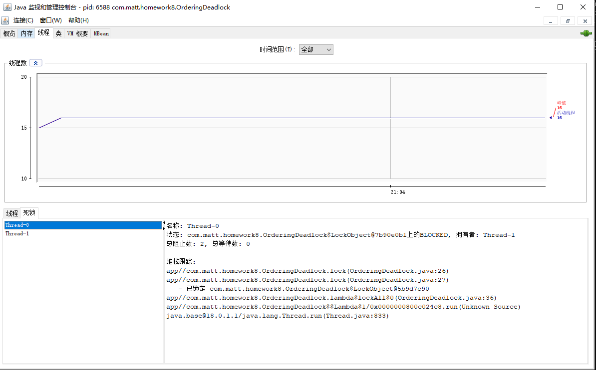

### Thread Dumps
```
"Thread-0@687" prio=5 tid=0x11 nid=NA waiting for monitor entry
  java.lang.Thread.State: BLOCKED
	 blocks Thread-1@691
	 waiting for Thread-1@691 to release lock on <0x2d7> (a com.matt.homework8.OrderingDeadlock$LockObject)
	  at com.matt.homework8.OrderingDeadlock.lock(OrderingDeadlock.java:26)
	  at com.matt.homework8.OrderingDeadlock.lock(OrderingDeadlock.java:27)
	  - locked <0x2d6> (a com.matt.homework8.OrderingDeadlock$LockObject)
	  at com.matt.homework8.OrderingDeadlock.lambda$lockAll$0(OrderingDeadlock.java:36)
	  at com.matt.homework8.OrderingDeadlock$$Lambda$1/0x0000000800c024c8.run(Unknown Source:-1)
	  at java.lang.Thread.run(Thread.java:833)

```
```
"Thread-1@691" prio=5 tid=0x12 nid=NA waiting for monitor entry
  java.lang.Thread.State: BLOCKED
	 blocks Thread-0@687
	 waiting for Thread-0@687 to release lock on <0x2d6> (a com.matt.homework8.OrderingDeadlock$LockObject)
	  at com.matt.homework8.OrderingDeadlock.lock(OrderingDeadlock.java:26)
	  at com.matt.homework8.OrderingDeadlock.lock(OrderingDeadlock.java:27)
	  - locked <0x2d7> (a com.matt.homework8.OrderingDeadlock$LockObject)
	  at com.matt.homework8.OrderingDeadlock.lock(OrderingDeadlock.java:27)
	  - locked <0x2d8> (a com.matt.homework8.OrderingDeadlock$LockObject)
	  at com.matt.homework8.OrderingDeadlock.lambda$lockAll$1(OrderingDeadlock.java:46)
	  at com.matt.homework8.OrderingDeadlock$$Lambda$2/0x0000000800c026d8.run(Unknown Source:-1)
	  at java.lang.Thread.run(Thread.java:833)

```

### Jstack

```

Found one Java-level deadlock:
=============================
"Thread-0":
  waiting to lock monitor 0x0000029cb54708f0 (object 0x0000000711d51490, a com.matt.homework8.OrderingDeadlock$LockObject),
  which is held by "Thread-1"

"Thread-1":
  waiting to lock monitor 0x0000029cb5470030 (object 0x0000000711d51480, a com.matt.homework8.OrderingDeadlock$LockObject),
  which is held by "Thread-0"

Java stack information for the threads listed above:
===================================================
"Thread-0":
	at com.matt.homework8.OrderingDeadlock.lock(OrderingDeadlock.java:26)
	- waiting to lock <0x0000000711d51490> (a com.matt.homework8.OrderingDeadlock$LockObject)
	at com.matt.homework8.OrderingDeadlock.lock(OrderingDeadlock.java:27)
	- locked <0x0000000711d51480> (a com.matt.homework8.OrderingDeadlock$LockObject)
	at com.matt.homework8.OrderingDeadlock.lambda$lockAll$0(OrderingDeadlock.java:36)
	at com.matt.homework8.OrderingDeadlock$$Lambda$1/0x0000000800c024c8.run(Unknown Source)
	at java.lang.Thread.run(java.base@18.0.1.1/Thread.java:833)
"Thread-1":
	at com.matt.homework8.OrderingDeadlock.lock(OrderingDeadlock.java:26)
	- waiting to lock <0x0000000711d51480> (a com.matt.homework8.OrderingDeadlock$LockObject)
	at com.matt.homework8.OrderingDeadlock.lock(OrderingDeadlock.java:27)
	- locked <0x0000000711d51490> (a com.matt.homework8.OrderingDeadlock$LockObject)
	at com.matt.homework8.OrderingDeadlock.lock(OrderingDeadlock.java:27)
	- locked <0x0000000711d514a0> (a com.matt.homework8.OrderingDeadlock$LockObject)
	at com.matt.homework8.OrderingDeadlock.lambda$lockAll$1(OrderingDeadlock.java:46)
	at com.matt.homework8.OrderingDeadlock$$Lambda$2/0x0000000800c026d8.run(Unknown Source)
	at java.lang.Thread.run(java.base@18.0.1.1/Thread.java:833)

Found 1 deadlock.

```
### JConsole



